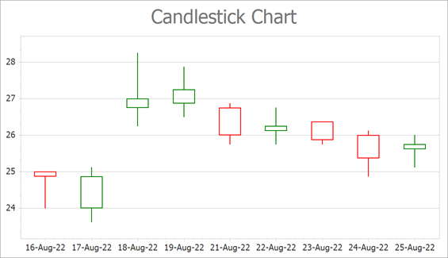

<!-- default badges list -->

<!-- default badges end -->

# Chart for WinForms - Create a Candlestick Chart

This example shows how to create a [Candlestick](https://docs.devexpress.com/WindowsForms/2988/controls-and-libraries/chart-control/series-views/2d-series-views/financial-series-views/candle-stick-chart) chart and bind it to data at runtime.

In this example, you add a [Series](https://docs.devexpress.com/CoreLibraries/DevExpress.XtraCharts.Series) object of the CandleStick view to the [ChartControl.Series](https://docs.devexpress.com/WindowsForms/DevExpress.XtraCharts.ChartControl.Series) collection. To specify the data source of the series, use the [DataSource](https://docs.devexpress.com/CoreLibraries/DevExpress.XtraCharts.Series.DataSource?p=netframework) property. Call the [SeriesBase.SetFinancialDataMembers](https://docs.devexpress.com/CoreLibraries/DevExpress.XtraCharts.SeriesBase.SetFinancialDataMembers(System.String-System.String-System.String-System.String-System.String)?p=netframework) method to define which data members store arguments, and _Open_, _High_, _Low_, and _Close_ values.

Cast the [View](https://docs.devexpress.com/CoreLibraries/DevExpress.XtraCharts.SeriesBase.View?p=netframework) property of the series to the [CandleStickSeriesView](https://docs.devexpress.com/CoreLibraries/DevExpress.XtraCharts.CandleStickSeriesView) type to access bar series appearance settings.

The Chart Control uses the [XY-Diagram](https://docs.devexpress.com/WindowsForms/5908/controls-and-libraries/chart-control/diagram/xy-diagram?p=netframework) to display candlestick series. Cast the [ChartControl.Diagram](https://docs.devexpress.com/WindowsForms/DevExpress.XtraCharts.ChartControl.Diagram?p=netframework) property to the [XYDiagram](https://docs.devexpress.com/CoreLibraries/DevExpress.XtraCharts.XYDiagram?p=netframework) type to access diagram settings. The Chart Control determines the diagram type based on the series that is added first. We recommend that you access the diagram to configure its settings after at least one series is added to the chart. 

## Files to Look At

* [Form1.cs](./CS/CandleStickChart/Form1.cs) (VB: [Form1.vb](./VB/CandleStickChart/Form1.vb))

## Documentation

* [Candle Stick Chart](https://docs.devexpress.com/WindowsForms/2988/controls-and-libraries/chart-control/series-views/2d-series-views/financial-series-views/candle-stick-chart)
* [Financial Charting](https://docs.devexpress.com/WindowsForms/8946/controls-and-libraries/chart-control/data-representation/financial-charting)

## More Examples

* [How to create a Stock chart](https://github.com/DevExpress-Examples/how-to-create-a-stock-chart-e1215)
* [How to display a regression line for a series](https://github.com/DevExpress-Examples/how-to-display-a-regression-line-for-a-series-e1494)
* [How to draw Fibonacci Arcs, Fans and Retracement for a Stock series](https://github.com/DevExpress-Examples/how-to-draw-fibonacci-arcs-fans-and-retracement-for-a-stock-series-e966)
